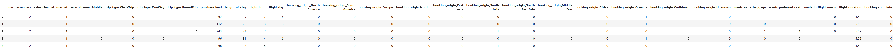

# Flight Booking Prediction (British Airways Data Science Project Part 2)

## Introduction
This is Part 2 of a project from the [British Airways Data Science micro-internship](https://www.theforage.com/simulations/british-airways/data-science-yqoz). British Airways is the flag carrier airline of the United Kingdom and is the second largest UK based carrier based on fleet size and passengers. British Airways has merged with Iberia, Spain's flag carrier airline, creating the International Airlines Group.

In this task, I take on the role of a junior data scientist employed at British Airways. British Airways has tasked me with collecting customer feedback and reviewing data from a third party source. I am also tasked with creating a predictive model to help determine which customers will book a flight for the upcoming holidays. **In this part of the project, I will analyze and conduct feature analysis on flight booking data, train and test a Random Forest model to predict which customers will book a flight, analyze the model performance with a confusion matrix, conduct feature importance analysis, and present my insights on a PowerPoint slide.**

## Problem Statement
British Airways is taking a proactive approach towards attracting customers. Rather than hoping that a customer purchases flights for the holidays as they come into the airport, British Airways is using data from past bookings and predictive models to determine how they can sell their flights to prospective customers. **Using their booking data, we will create and modify features so that they can be used in a Random Forest model. We will then train and tewst the model and analyze it's performance in order to understand how predictive the data really was and whether we can feasibly use it to predict the target outcome (customers buying holidays). The results will be summarized in a Power Point Slide which will be used in a board meeting.**

## Skills Demonstrated
* Jupyter Notebook
* Python
* Data Cleaning
* Data Manipulation
* Data Visualization
* Feature Engineering
* Machine Learning
* Random Forest
* Training and Testing Machine Learning Models
* Confusion Matrix
* Feature Importance
* Power Point

## Data Sourcing
This data was provided to me by the British Airways Data Science micro-internship hosted by Forage. A copy of the data is included in this repository under the file name: customer_booking.csv.

## Data Attributes
The data that we are using to train and test our Random Forest model is provided by British Airways. The data contains 50000 data points (rows) and 14 attribtues (columns).
* num_passengers - Number of passengers travelling.
* sales_channel - Sales channel booking was made on.
* trip_type - Trip type (Round Trip, One Way, Circle Trip).
* purchase_lead - Number of days between travel date and booking date.
* length_of_stay - Number of days spent at destination.
* flight_hour- Hour of flight departure.
* flight_day - Day of week of flight departure.
* route - Origin to destination flight route.
* booking_origin - Country from where booking was made.
* wants_extra_baggage - If the customer wanted extra baggage in the booking.
* wants_preferred_seat - If the customer wanted a preferred seat in the booking.
* wants_in_flight_meals - If the customer wanted in-flight meals in the booking.
* flight_duration - Total duration of flight in hours.
* booking_complete - Flag indicating if the customer completed the booking.

## Booking Prediction
To predict whether a customer will book a flight or not, we must analyze, manipulate, and transform raw data into necessary features for machine learning. Then we will train and test a Random Forest model, analyze its performance, and determine which features are most important to customers when booking a flight.

A copy of this project is included in this repository under the file name: James Weber Random Forest British Airway.ipynb.

### 1. Importing Libraries and Data
We must first import libraries which contains the commands we need for feature engineering and to train and test a Random Forest model.
Then we import the data from the customer_booking.csv file into the df dataframe.
```
# Import libraries.

import pandas as pd
import numpy as np
import seaborn as sns
from datetime import datetime
import matplotlib.pyplot as plt

%matplotlib inline

sns.set(color_codes = True)

# Used to calculate accuracy, precision, recall, and confusion matrix.

from sklearn import metrics

# Used to create training and test data.

from sklearn.model_selection import train_test_split

# Used to create a random forest model.

from sklearn.ensemble import RandomForestClassifier

# Used to create plot trees to visualize each random forest decision tree.

from sklearn.tree import plot_tree

# Use the pd.read_csv() to import a csv file into Jupyter notebook.
# Some values in the csv file contain characters not in UTF-8.
# Use encoding = "ISO-8859-1" to include those characters.

df = pd.read_csv(r'C:/Users/jwebe/OneDrive/Desktop/customer_booking.csv', encoding = "ISO-8859-1")
```
Now that we imported the data into the df dataframe, let's get a better understanding of the dataframe by looking up some information on it.
```
# Use the .info() command to see how many non null values are in each column and the data type of each column.

df.info()
```


The picture above depicts a table that contains information on the df dataframe, including column names, number of non null values in each column, and the data type for each column. **All columns contain 50000 non null entries, so there are no missing values to replace. All columns also contain the proper data types.**

Columns that contain object data type can only contain non numeric (categorical) data. Columns that contain int64 data type can only contain whole number data. Columns that contain float64 data type can only contain decimal number data.

### 2. Feature Engineering
**Feature engineering is the process of selecting, manipulating and transforming raw data into new features (attributes or columns) that can be used in machine learning. Machine learning models are not capable of using categorical (non numeric) data as inputs.** The picuture above shows 5 columns with categorical data: sales_channel, trip_type, flight_day, route, and booking_origin.

**Label encoding is a process of converting categorical data into numeric data by replacing categorical data wih numbers.** The flight_day column contains the days of the week in a non numeric format: Mon, Tue, Wed, Thy, Fri, Sat, and Sun. **Categorical data with a specific order or hierarchy, such as days of the week, is called ordinal data.** Since days of the week have a specific order, we can replace Mon with the value of 1, Tue with the value of 2, and so on.

The code below will replace the days of the week with numbers.
```
# Create a dictionary that converts a day of the week into a number.

mapping = {'Mon': 1, 
           'Tue': 2,
           'Wed': 3, 
           'Thu': 4, 
           'Fri': 5, 
           'Sat': 6, 
           'Sun': 7}

# Use the .map() command to map a dictionary to a column.

df['flight_day'] = df['flight_day'].map(mapping)
```

The sales_channel and trip_type columns contain categorical data that needs to be converted to numeric data. **Sales channel and trip type data are also nominal data. Unlike ordinal data, nominal data do not have an order or hierarchy. Rather than using label encoding, it is better to create dummy variables for sales channel and trip type data.**

With label encoding, we replace categorical data with numbers. By doing so, we imply that certain data are more closely related to other data. For example, Thu (labeled as 4) is more closely related to Wed or Fri (labeled as 3 and 5) and less closely related to Mon or Sun (labeled as 1 and 7). This makes sense if the data has an order or hierarchy (ordinal data).

Nominal data do not have a specific order or hierachy, and label encoding may create relationships between data where there aren't any. One way to convert nominal data is to create dummy variables. **When we create dummy variables, we create a new column for each unique value in a column.** The sales_channel column will create 2 new columns: sales_channel_internet and sales_channel_mobile. The trip_type column will create 3 new columns: trip_type_CircleTrip, trip_type_OneWay, and trip_type_RoundTrip.

**Each dummy variable column will either contain a 1 or 0. A value of 1 indicates that a data point contains that attribute and a value of 0 indicate that a data point does not contain that attribute.** If a customer purchased a round trip flight via the internet, the dummy variable columns trip_type_RoundTrip and sales_channel_internet will contain 1 and the remaining dummy variable columns will contain 0.

The code below will create dummy variables for the sales_channel column.
```
# The sales_channel data needs to be converted into numeric data.
# Since sales_channel do not have a particular order or heirarchy, dummy variables are needed.
# Use the pd.get_dummies() command to create dummy variables for sales_channel.

df_dummy_sales_channel = 'sales_channel_' + df['sales_channel']
df_dummy_sales_channel = pd.get_dummies(df_dummy_sales_channel)

# Use the .astype() command to convert Boolean data type into int data type.

df_dummy_sales_channel = df_dummy_sales_channel.astype(int)

# Replace the original sales_channel column with the 2 dummy variable columns.
# Use the .drop() command to drop the sales_channel column.

df = df.drop(columns = 'sales_channel')

# Use the .insert() command to insert a column from one dataframe into another.

df.insert(1, 'sales_channel_Internet', df_dummy_sales_channel.loc[:, 'sales_channel_Internet'])
df.insert(2, 'sales_channel_Mobile', df_dummy_sales_channel.loc[:, 'sales_channel_Mobile'])
```

The code below will create dummy variables for the travel_type column.
```
# The trip_type data needs to be converted into numeric data.

df_dummy_trip_type = 'trip_type_' + df['trip_type']
df_dummy_trip_type = pd.get_dummies(df_dummy_trip_type)
df_dummy_trip_type = df_dummy_trip_type.astype(int)

# Replace the original trip_type column with the 3 dummy variable columns.

df = df.drop(columns = 'trip_type')

df.insert(3, 'trip_type_CircleTrip', df_dummy_trip_type.loc[:, 'trip_type_CircleTrip'])
df.insert(4, 'trip_type_OneWay', df_dummy_trip_type.loc[:, 'trip_type_OneWay'])
df.insert(5, 'trip_type_RoundTrip', df_dummy_trip_type.loc[:, 'trip_type_RoundTrip'])
```

The booking_origin column contains categorical, nominal data. Let's see how many unique values are in the bookin_origin column.
```
# Use the .unique() command to see the unique values in the booking_origin column.

df['booking_origin'].unique()
```


The picture above is a list of unique values in the booking_origins column. There are 103 unique values, not including the (not set) value. **We cannot create dummy variables for all unique values in the booking_origins column. This will add over 100 new columns to the data which will decrease the machine learning model's efficiency and effectiveness.**

**Rather than creating a dummy variable for all unique values, we will group these values into regions. Then we will create dummy variables for each region.** The uniques values can be grouped into 11 different regions: North America, South America, Europe, Nordic, East Asia, South Asia, South East Asia, Middle East, Africa, Oceania, and Caribbean. Values that are labeled (not set) will be placed in an "Unknown" group.

The code below will replace all booking origin locations with a regional location.
```
# Use the .replace() command to replace the booking origin countries with a region.

df['booking_origin'] = df['booking_origin'].replace(['United States', 'Mexico', 'Canada'], 
                                                     'North America')

df['booking_origin'] = df['booking_origin'].replace(['Brazil', 'Argentina', 'Chile', 'Colombia', 'Paraguay', 'Peru'], 
                                                     'South America')

df['booking_origin'] = df['booking_origin'].replace(['United Kingdom', 'Switzerland', 'Poland', 'Estonia', 'Belgium', 'France', 
                                                     'Hungary', 'Netherlands', 'Germany', 'Bulgaria', 'Spain', 'Czechia', 
                                                     'Austria', 'Slovenia', 'Romania', 'Italy', 'Greece', 'Croatia', 
                                                     'Malta', 'Portugal', 'Slovakia', 'Russia', 'Ireland', 'Ukraine', 
                                                     'Belarus', 'Cyprus', 'Turkey', 'Kazakhstan', 'Czech Republic', 'Gibraltar'], 
                                                     'Europe')

df['booking_origin'] = df['booking_origin'].replace(['Denmark', 'Norway', 'Sweden', 'Finland', 'Svalbard & Jan Mayen'], 
                                                     'Nordic')

df['booking_origin'] = df['booking_origin'].replace(['China', 'Japan', 'South Korea', 'Mongolia', 'Hong Kong', 'Taiwan', 'Macau'], 
                                                     'East Asia')

df['booking_origin'] = df['booking_origin'].replace(['India', 'Pakistan', 'Maldives', 'Nepal', 'Sri Lanka', 'Afghanistan', 'Bangladesh', 'Bhutan'], 
                                                     'South Asia')

df['booking_origin'] = df['booking_origin'].replace(['Brunei', 'Myanmar (Burma)', 'Cambodia', 'Timor-Leste', 'Indonesia', 'Laos', 
                                                     'Malaysia', 'Philippines', 'Singapore', 'Thailand', 'Vietnam'], 
                                                     'South East Asia')

df['booking_origin'] = df['booking_origin'].replace(['Iran', 'Israel', 'Saudi Arabia', 'Lebanon', 'United Arab Emirates', 'Jordan', 'Iraq', 
                                                     'Kuwait', 'Bahrain', 'Oman', 'Qatar', 'Egypt', 'Tunisia'], 
                                                     'Middle East')

df['booking_origin'] = df['booking_origin'].replace(['Algeria', 'Kenya', 'Tanzania', 'South Africa', 'Réunion', 'Mauritius', 'Seychelles', 'Ghana'], 
                                                     'Africa')

df['booking_origin'] = df['booking_origin'].replace(['Australia', 'New Zealand', 'Papua New Guinea', 'Solomon Islands', 'Tonga', 
                                                     'New Caledonia', 'Norfolk Island', 'Guam', 'Vanuatu'], 
                                                     'Oceania')

df['booking_origin'] = df['booking_origin'].replace(['Nicaragua', 'Guatemala', 'Panama'], 
                                                     'Caribbean')

df['booking_origin'] = df['booking_origin'].replace(['(not set)'], 
                                                     'Unknown')
```

Now that we have **reduced the number of unique values in the booking_origin column from 103 unique values to 12 unique values**, we will create dummy variables for each unique value.

The code below will create dummy variables for the booking_origin column.
```
# The trip_type data needs to be converted into numeric data.

df_dummy_booking_origin = 'booking_origin_' + df['booking_origin']
df_dummy_booking_origin = pd.get_dummies(df_dummy_booking_origin)
df_dummy_booking_origin = df_dummy_booking_origin.astype(int)

# Replace the original trip_type column with the 13 dummy variable columns.

df = df.drop(columns = 'booking_origin')

df.insert(10, 'booking_origin_North America', df_dummy_booking_origin.loc[:, 'booking_origin_North America'])
df.insert(11, 'booking_origin_South America', df_dummy_booking_origin.loc[:, 'booking_origin_South America'])
df.insert(12, 'booking_origin_Europe', df_dummy_booking_origin.loc[:, 'booking_origin_Europe'])
df.insert(13, 'booking_origin_Nordic', df_dummy_booking_origin.loc[:, 'booking_origin_Nordic'])
df.insert(14, 'booking_origin_East Asia', df_dummy_booking_origin.loc[:, 'booking_origin_East Asia'])
df.insert(15, 'booking_origin_South Asia', df_dummy_booking_origin.loc[:, 'booking_origin_South Asia'])
df.insert(16, 'booking_origin_South East Asia', df_dummy_booking_origin.loc[:, 'booking_origin_South East Asia'])
df.insert(17, 'booking_origin_Middle East', df_dummy_booking_origin.loc[:, 'booking_origin_Middle East'])
df.insert(18, 'booking_origin_Africa', df_dummy_booking_origin.loc[:, 'booking_origin_Africa'])
df.insert(19, 'booking_origin_Oceania', df_dummy_booking_origin.loc[:, 'booking_origin_Oceania'])
df.insert(20, 'booking_origin_Caribbean', df_dummy_booking_origin.loc[:, 'booking_origin_Caribbean'])
df.insert(21, 'booking_origin_Unknown', df_dummy_booking_origin.loc[:, 'booking_origin_Unknown'])
```

The last column that contains non numeric, categorical data is the route column. Let's see how many unique values are in the route column.
```
# Use the .unique() command to see the unique values in the booking_origin column.

df['route'].unique()
```


The picture above is a sample of the unique values in the route column. There are 799 different routes that British Airways take. Similar to the booking_origin column, the route column contains too many unique values to create dummy variables with. However, there are no obvious categories that we can group the routes. **Since booking_origins provide information on customer's location, we will remove the route column to reduce redundancy.**

The code below will drop the route column from the dataframe.
```
# Use the .drop() command to delete a column.

df = df.drop(columns = 'route')
```

